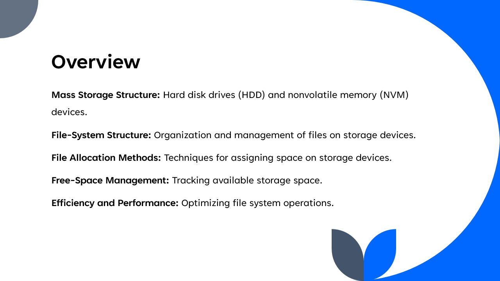
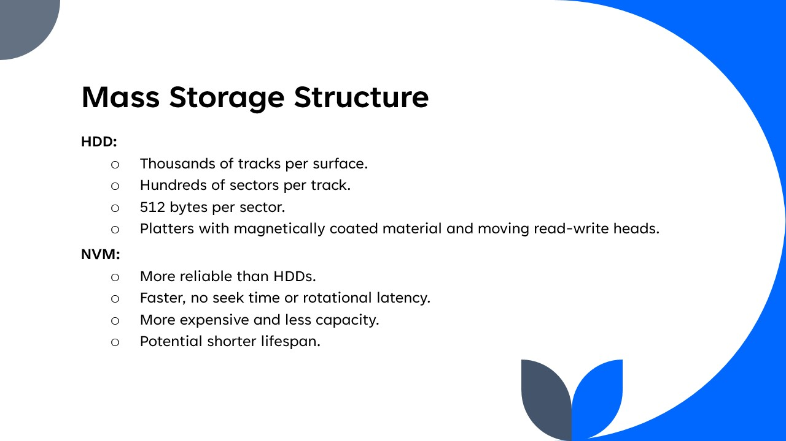
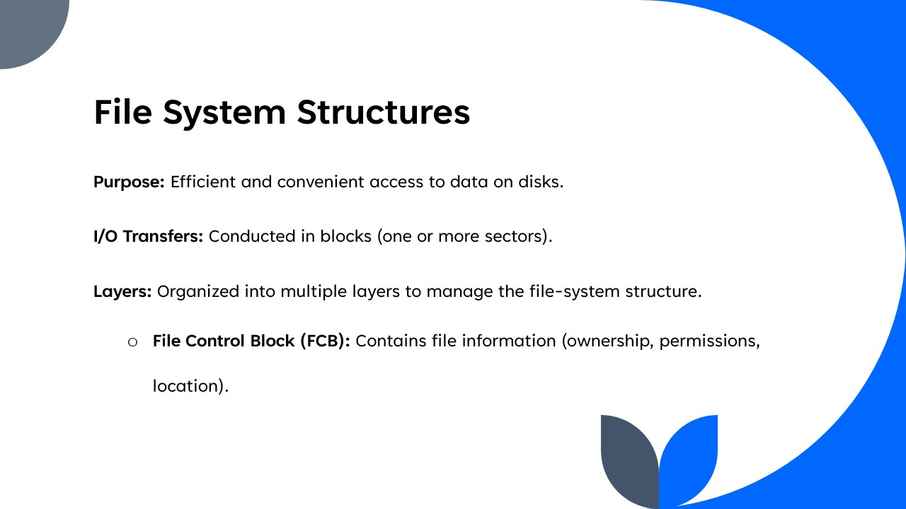
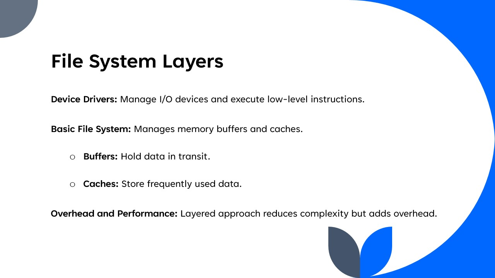
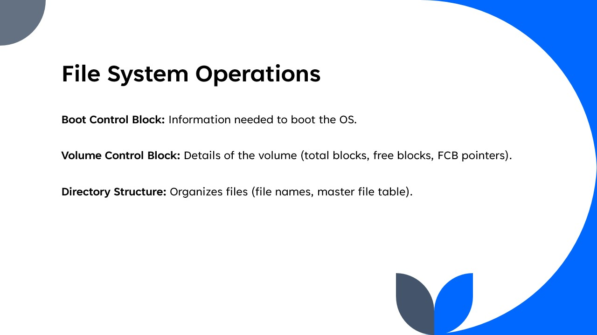
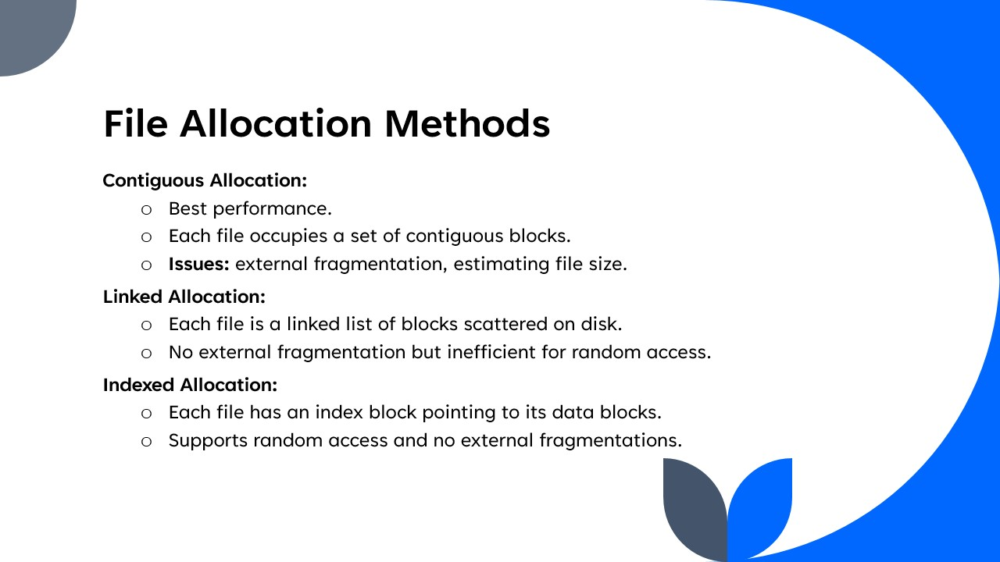
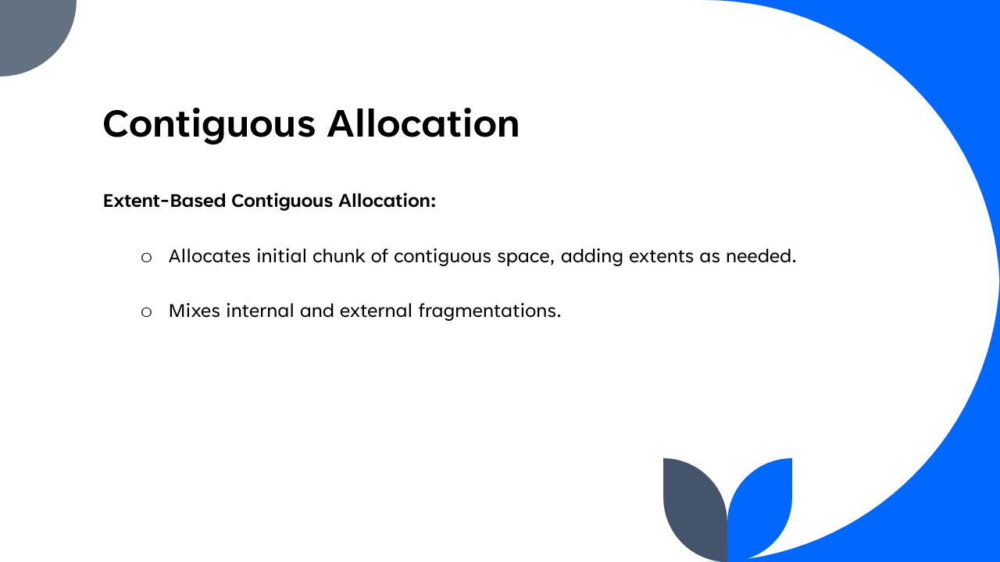
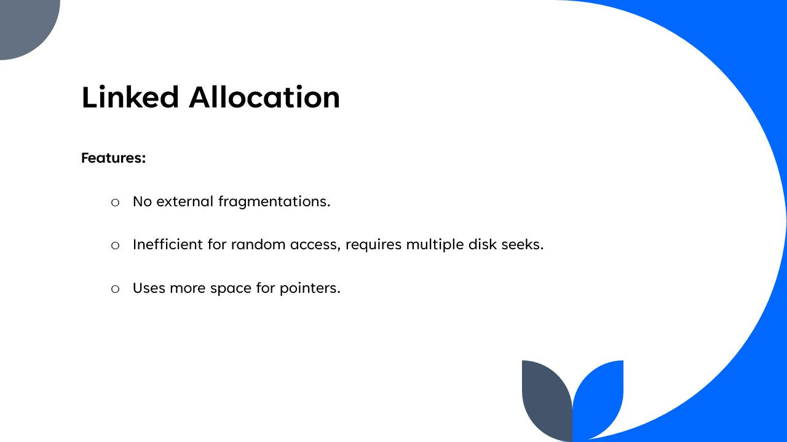
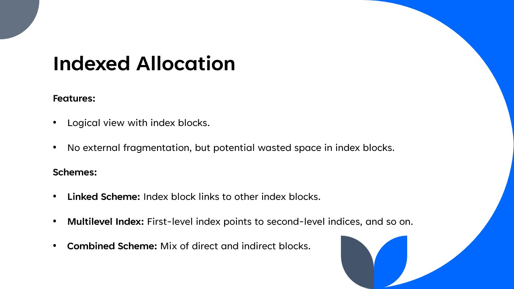
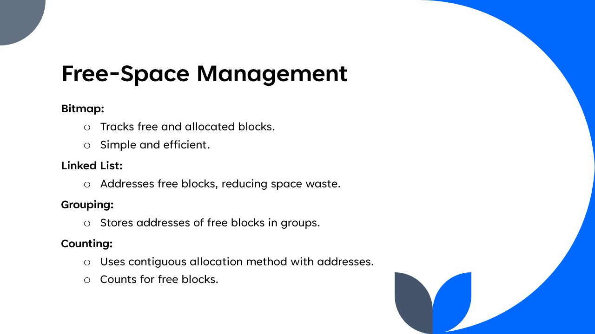

# Index Allocation Game

This project is an educational game designed to teach the concepts of file allocation in operating systems, specifically focusing on indexed allocation methods. The game provides three difficulty levels: Linked Scheme (Easy), Multilevel Index (Medium), and Combined Scheme (Hard), each representing different file allocation schemes.

## Table of Contents

- [Features](#features)
- [How to Play](#how-to-play)
- [Setup](#setup)
- [Usage](#usage)
- [Game Modes](#game-modes)
- [Learn Theory](#learn-theory)
- [Slides](#slides)
- [License](#license)

## Features

- **Linked Scheme (Easy Mode)**: Single-level index allocation.
- **Multilevel Index (Medium Mode)**: Two-level index allocation.
- **Combined Scheme (Hard Mode)**: Multilevel index allocation with multiple files.
- **Interactive Gameplay**: Visual representation of file blocks and pointers.
- **Educational**: Helps users understand the file allocation concepts through an engaging game.

## How to Play

1. **Select a Difficulty**: Choose between Linked Scheme, Multilevel Index, and Combined Scheme modes.
2. **Index Selection**: Click the "Index" button to highlight the index block(s). Click the highlighted block to confirm your selection.
3. **Data Block Selection**: Click the "Data" button to highlight the data blocks. Click the highlighted blocks to confirm your selections.
4. **Win Condition**: Correctly select all the data blocks as per the index blocks to win the game.
5. **Restart**: Click the "Restart" button to start a new game.

## Setup

1. **Download the project**:
    - Clone the repository:
      ```sh
      git clone https://github.com/Voidstorm012/Index-Allocation-Game.git
      ```

    - Or download the ZIP file from the [repository](https://github.com/Voidstorm012/Index-Allocation-Game) and extract it.

2. **Navigate to the project directory**:
    ```sh
    cd Index-Allocation-Game
    ```

3. **Open `index.html` in your browser**.

## Usage

1. Open the `index.html` file in a web browser.
2. Select the desired difficulty level.
3. Follow the game instructions to complete the file allocation tasks.

## Game Modes

### Linked Scheme (Easy Mode)

- **Description**: This mode represents a single-level index allocation scheme where each file has an index block pointing directly to its data blocks.
- **Educational Benefit**: Helps users understand the basic concept of indexed allocation without the complexity of multiple levels.

### Multilevel Index (Medium Mode)

- **Description**: This mode represents a two-level index allocation scheme. A primary index block points to secondary index blocks, which in turn point to the actual data blocks.
- **Educational Benefit**: Illustrates the hierarchical nature of multilevel indexing, providing a deeper understanding of how larger files are managed in file systems.

### Combined Scheme (Hard Mode)

- **Description**: This mode represents a multilevel index allocation with multiple files. Each file uses a mix of direct and indirect blocks, simulating a more complex real-world scenario.
- **Educational Benefit**: Demonstrates the combined use of direct and indirect indexing, showcasing the efficiency and complexity of advanced file allocation methods.

## Learn Theory

### Indexed Allocation

**Features:**
- Logical view with index blocks.
- No external fragmentation, but potential wasted space in index blocks.

**Schemes:**
- **Linked Scheme**: Index block links to other index blocks.
- **Multilevel Index**: First-level index points to second-level indices, and so on.
- **Combined Scheme**: Mix of direct and indirect blocks.














## License

Distributed under the MIT License. See `LICENSE` for more information.
